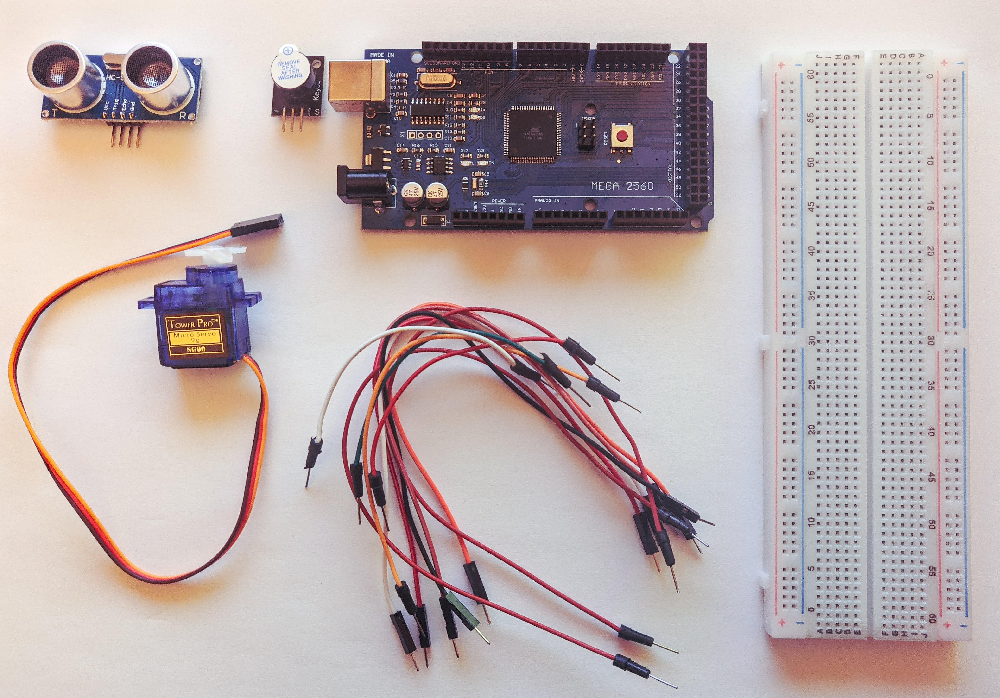

# Distance Observing Rotating Unit

## Requirements
The system will have an ultrasonic sensor that can rotate at a constant speed around an axis to cover a certain angle of view, for example from 15 degrees to 165 degrees. This can be done by mounting the ultrasonic sensor on a servomotor controlled by the microcontroller.

A distance between 10 and 70 - 100 cm will be measured; the ultrasonic sensor will continuously measure the distance to the objects around it, while rotating at a constant speed, thus achieving a permanent sweep of the field of vision, similar to a radar system. Based on the distance measurements obtained, a real-time mapping of the area around the sensor will be performed, which will be graphically represented by an application that will run on the computer / laptop / tablet / smartphone (for example, in the simplest version , the areas where no objects are detected are displayed in green and the areas where there is an object detected in red, also showing the value of the angle at which that object is detected).

Simply displaying the distance to objects is not enough to promote the project. The creation of the graphic application is also required. Implementation is up to the students, for example it can be a C # program running on a laptop or desktop computer, it can be a graphical web application in the browser or it can be an Android graphical application running on a mobile device.

## Implementation
### Hardware
For starters, the board used was an **Arduino Mega 2560**. Other components:
- HC-SR04 ultrasonic sensor
- SG90 servo
- KY-006 passive buzzer
- breadboard
- jumper wires

The following picture shows the schematic.

### Software
The app consists of two parts:
- `source.ino` - which contains the source code run on the Arduino board
- `draw_radar.py` - which contains the source code for visually processing the data

For programming the board, two additional libraries are required:
- `NewPing.h` - used for controlling the ultrasonic sensor
- `Servo.h` - used for controlling the servo

The visual processing part is written in Python v3.8 and uses the following packages:
- `tkinter` - user for creating the UI
- `serial` - used for serial communication with the Arduino board
- `math` - used for trigonometric functions

### How it works
The program created by `source.ino` is uploaded on the Arduino board. Immediately after execution, the servo will start spinning and the ultrasonic sensor will start measuring distances. If it detects an object, depending on its distance to the sensor, the buzzer will begin announcing the object's presence, similar to how parking sensors on a car work.

The data collected by the Arduino is sent to the PC through serial communication and gets picked up by the small app (based on the `draw_radar.py` code). In a new window, the data will be mapped and displayed similar to a radar.

